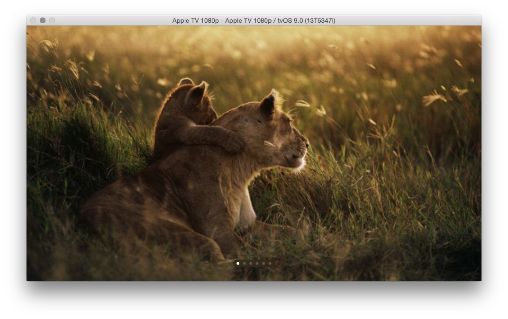

This is a **proof of concept** app with [NativeScript for iOS](https://github.com/NativeScript/ios-runtime) running on [Apple TV](http://www.apple.com/tv/).

You can find more info in the related [blog post](https://www.nativescript.org/blog/running-the-nativescript-runtime-for-ios-on-apple-tv).

## Requirements
* OS X 10.10.4+
* Xcode 7.1+

## Getting Started
This is a plain Xcode project, without the NativeScript CLI.

To run the application simply open the Xcode project in the `TVKitApp` folder and click "Play".
